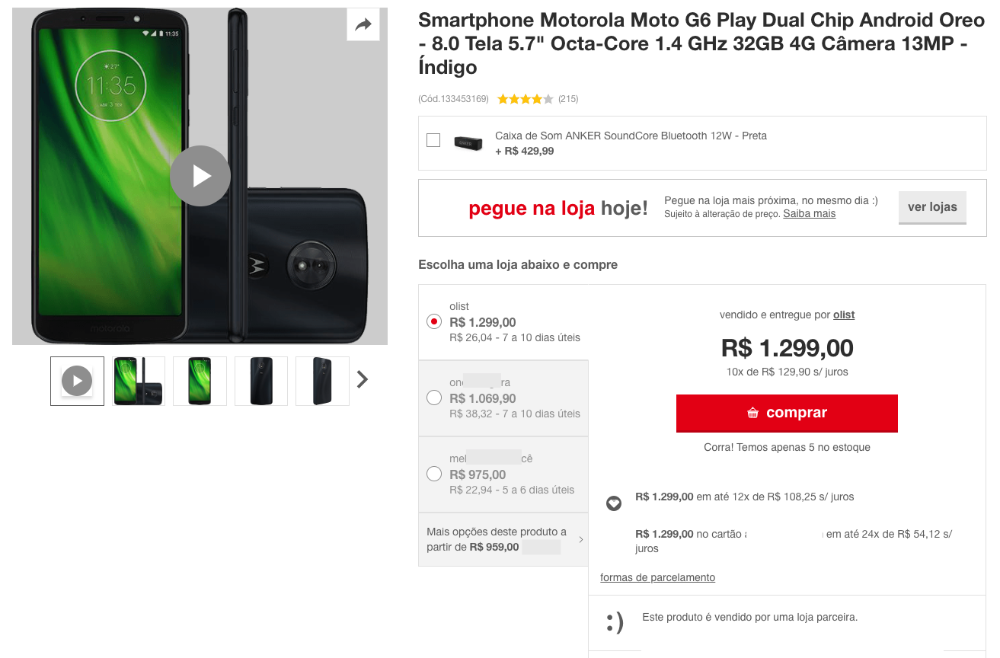

# Sobre o PY Data

Este repositório contém scripts Python para configurar um ambiente virtual (venv), instalar dependências e baixar um conjunto de dados públicos de e-commerce brasileiro da Olist. O objetivo será de implementar uma pequena API em Flask para trabalhar com esses dados onde além do usu como API - REST, também será possível fazer análises exploratórias e visualizações de dados através do front-end do próprio Flask através de templates HTML.

## Sobre o Conjunto de Dados de E-commerce Brasileiro da Olist

Bem-vindo! Este é um conjunto de dados públicos de e-commerce brasileiro com pedidos feitos na Loja [Olist](https://www.olist.com/) disponibilizado no [Kaggle](https://www.kaggle.com/datasets/olistbr/brazilian-ecommerce). O conjunto de dados contém informações de 100 mil pedidos de 2016 a 2018, feitos em diversos marketplaces no Brasil. Seus recursos permitem visualizar um pedido em diversas dimensões: desde o **status do pedido**, **preço**, **pagamento** e **desempenho do frete até a localização do cliente**, **atributos do produto** e, por fim, **avaliações escritas por clientes**. Também foi disponibilizado um conjunto de dados de geolocalização que relaciona CEPs brasileiros às coordenadas de latitude/longitude.

Estes são dados comerciais reais, foram anonimizados e as referências às empresas e parceiros no texto da avaliação foram substituídas pelos nomes das grandes casas de Game of Thrones.

### Contexto

Este conjunto de dados foi generosamente cedido pela Olist, a maior loja de departamentos dos marketplaces brasileiros. A Olist conecta pequenas empresas de todo o Brasil a canais sem complicações e com um único contrato. Esses comerciantes podem vender seus produtos através da Loja Olist e enviá-los diretamente aos clientes usando os parceiros de logística da Olist.

Após a compra de um produto na Loja Olist, o vendedor é notificado para processar o pedido. Assim que o cliente recebe o produto ou a data estimada de entrega se aproxima, ele recebe uma pesquisa de satisfação por e-mail, onde pode registrar sua experiência de compra e fazer alguns comentários.

### Atenção

1. Um pedido pode ter vários itens.
2. Cada item pode ser processado por um vendedor diferente.
3. Todos os textos que identificam lojas e parceiros foram substituídos pelos nomes das grandes casas de Game of Thrones.

#### Exemplo de listagem de produto em um marketplace

## Estrutura dos Dados

Os dados estão organizados em 9 arquivos CSV:

- `olist_customers_dataset.csv`: informações sobre os clientes (ID do cliente, localização, etc.).

- `olist_geolocation_dataset.csv`: informações de geolocalização (CEP, cidade, estado, latitude, longitude).

- `olist_order_items_dataset.csv`: informações sobre os itens do pedido (ID do pedido, ID do produto, preço, quantidade, etc.).

- `olist_order_payments_dataset.csv`: informações sobre os pagamentos do pedido (ID do pedido, método de pagamento, valor, etc.).

- `olist_order_reviews_dataset.csv`: informações sobre as avaliações do pedido (ID do pedido, nota, comentário, etc.).

- `olist_orders_dataset.csv`: informações sobre os pedidos (ID do pedido, status, data, etc.).

- `olist_products_dataset.csv`: informações sobre os produtos vendidos pela Olist (ID do produto, nome, categoria, etc.).

- `olist_sellers_dataset.csv`: informações sobre os vendedores (ID do vendedor, localização, etc.).

- `product_category_name_translation.csv`: tradução dos nomes das categorias de produtos do português para o inglês.

## Consulte o esquema de dados

